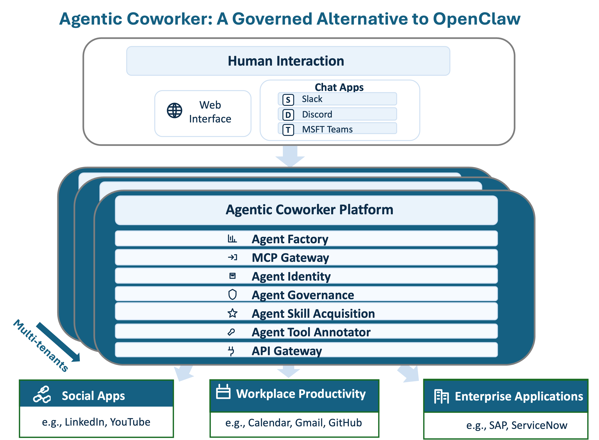

# Agentic Coworker - Architecture Documentation

## Table of Contents

- [Overview](#overview)
- [System Architecture](#system-architecture)
- [Core Components](#core-components)
- [Data Flow](#data-flow)
- [Security Architecture](#security-architecture)
- [Scalability and High Availability](#scalability-and-high-availability)
- [Technology Stack](#technology-stack)
- [Design Patterns](#design-patterns)

## Overview

Agentic Coworker is a governed AI agent platform that enables autonomous agents to work across social platforms, productivity tools, and enterprise systems while maintaining enterprise-grade security, governance, and compliance.

### Key Architectural Principles

1. **Multi-Tenancy**: Complete isolation of data, tools, and credentials across organizational boundaries
2. **Security by Design**: OAuth 2.0, encrypted credentials (AES-256-GCM), fine-grained permissions
3. **Modular Architecture**: Loosely coupled services communicating via well-defined APIs
4. **Event-Driven**: Real-time coordination through NATS message queue
5. **Scalability**: Horizontal scaling through containerization and stateless services
6. **Extensibility**: Plugin-based tool acquisition and MCP protocol integration

## System Architecture



### Architecture Layers

#### 1. Human Interaction Layer

**Purpose**: Provides multiple interfaces for humans to interact with AI agents

**Components**:
- **Web Interface** (Agent Studio): React-based SPA for agent management
- **Chat Apps Integration**: Slack, Discord, Teams connectors
- **API Gateway**: RESTful API for programmatic access

**Technologies**: Next.js 15, React 19, TypeScript, NextAuth.js

#### 2. Agentic Coworker Platform

**Purpose**: Core platform services for agent lifecycle, governance, and operations

**Components**:

##### Agent Factory
- Creates and initializes agent instances
- Manages agent lifecycle (create, start, stop, terminate)
- Assigns roles and permissions to agents
- Handles agent configuration and customization

##### MCP Gateway
- Implements Model Context Protocol for standardized tool interaction
- Dynamic tool loading and discovery
- Tool schema validation and testing
- Protocol translation between agents and external services

##### Agent Identity
- OAuth 2.0 authentication and token management
- Multi-provider support (Google, GitHub, LinkedIn, ServiceNow)
- Automatic token refresh and credential rotation
- Encrypted credential storage (AES-256-GCM)

##### Agent Governance
- Role-based access control (RBAC)
- Permission enforcement at tool and domain level
- Audit logging of all agent actions
- Resource quotas and rate limiting
- Tenant isolation enforcement

##### Agent Skill Acquisition
- Automated import from API documentation
- OpenAPI/Swagger specification parsing
- Postman collection import
- Tool validation and testing
- Semantic tool discovery using vector embeddings

##### Agent Tool Annotator
- Semantic metadata extraction
- Tool categorization by domain and capability
- Vector embeddings generation for tool discovery
- Relationship mapping in knowledge graph

##### API Gateway
- Request routing and load balancing
- Rate limiting and throttling
- Request/response transformation
- Caching layer for frequently accessed data

#### 3. Integration Layer

**Purpose**: Connect agents to external systems and data sources

**Categories**:

##### Social Apps
- LinkedIn API integration
- Profile data access
- Content posting and engagement
- Connection management

##### Workplace Productivity
- **Google Workspace**: Gmail, Calendar, Drive
- **GitHub**: Repositories, Issues, Pull Requests
- **Microsoft 365**: Outlook, OneDrive, Teams (extensible)

##### Enterprise Applications
- **SAP**: Business APIs, ERP integration
- **ServiceNow**: ITSM, Incident/Problem/Change management
- **Custom REST APIs**: Dynamic integration support

## Core Components

### 1. Agent Studio (Frontend)

**Technology**: Next.js 15, React 19, TypeScript

**Pages and Features**:

```
/portal
├── /dashboard          # Overview metrics and agent status
├── /agent-mngt         # Agent lifecycle management
├── /agent-profile      # Agent configuration and roles
├── /agent-chat         # Human-agent conversation interface
├── /mcp-tools          # Tool library and management
├── /tool-importer      # Import tools from various sources
├── /mcp-services       # MCP service configuration
├── /staging-services   # Test environment for new tools
├── /auth-providers     # OAuth provider configuration
├── /provider-tokens    # Token management and refresh
├── /service-secrets    # API key and credential management
├── /domains            # Business domain organization
└── /user-mngt          # User and access management
```

**Key Features**:
- Server-side rendering for performance
- Real-time updates via SSE (Server-Sent Events)
- NextAuth.js for authentication
- Responsive design for desktop and mobile
- Dark mode support

### 2. Integrator Service

**Technology**: Python 3.11+, FastAPI, LangChain

**Responsibilities**:
- Central hub for service coordination
- API consumption and orchestration
- LLM integration (Azure OpenAI, OpenAI, Google AI, Anthropic, Local)
- Tool execution and result processing
- Staging environment for tool testing
- Logging and monitoring

**API Endpoints**:
```
/mcp              # MCP service management
/staging          # Staging and validation
/users            # User management
/oauth            # OAuth2 authentication
/logs             # Application logs
/client           # API consumption client
```

**Module Structure**:
```
integrator/
├── apis/         # FastAPI application and routes
├── iam/          # Identity and Access Management
├── publish/      # Service lifecycle management
├── staging/      # Testing and validation environment
├── clients/      # API consumption client
├── logs/         # Centralized logging
└── utils/        # Utilities (DB, crypto, etc.)
```

### 3. MCP Services

**Technology**: Python, Model Context Protocol SDK

**Responsibilities**:
- Dynamic tool loading from Integrator
- Multi-tenant tool isolation
- OAuth 2.0 token validation
- Tool execution proxying
- Support for SSE and stdio transports

**Features**:
- Real-time tool updates without restart
- Tenant-based configuration
- Secure token management
- API call proxying through configurable URL

### 4. Support Services

**Technology**: Python, FastAPI

**Services**:
- Health check monitoring
- Metrics collection
- Backup and restore utilities
- Administrative APIs

### 5. Agent Ops

**Technology**: Python CLI

**Capabilities**:
- Database initialization and seeding
- Backup and restore operations
- Credential updates (OAuth providers, API keys)
- Migration scripts
- Data validation and cleanup

**Commands**:
```bash
agent_ops backup                    # Create database backup
agent_ops restore                   # Restore from backup
agent_ops update                    # Update credentials
agent_ops seed                      # Initialize with sample data
agent_ops migrate                   # Run migrations
```

## Data Flow

### 1. Agent Initialization Flow

```
User Request → Agent Studio → Integrator API
    ↓
Agent Factory creates agent instance
    ↓
Assign role → Load permissions → Configure tools
    ↓
Agent Identity assigns credentials
    ↓
Agent ready for tasks
```

### 2. Tool Execution Flow

```
Agent receives task → Analyzes requirements
    ↓
Agent Skill Acquisition: Semantic search for relevant tools
    ↓
MCP Gateway: Retrieve tool definition
    ↓
Agent Governance: Check permissions
    ↓
Agent Identity: Retrieve OAuth token
    ↓
API Gateway: Route to external service
    ↓
Execute API call → Return results
    ↓
Agent processes response → Continue workflow
```

### 3. Tool Import Flow

```
User submits API documentation → Tool Importer
    ↓
Parse OpenAPI/Swagger/Postman collection
    ↓
Extract endpoints, parameters, auth requirements
    ↓
Agent Tool Annotator: Generate semantic metadata
    ↓
Store in Staging Environment
    ↓
User tests tool with sample data
    ↓
Validate schema and response
    ↓
Publish to production → Available to agents
```

### 4. OAuth Authentication Flow

```
User initiates OAuth → Agent Studio redirects to provider
    ↓
User grants permissions → Provider redirects back with code
    ↓
Agent Identity exchanges code for access token
    ↓
Encrypt and store token in database
    ↓
Associate token with tenant and provider
    ↓
Agent retrieves token when calling APIs
    ↓
Agent Identity refreshes token automatically when expired
```

## Security Architecture

### Authentication and Authorization

#### Multi-Level Authentication

1. **User Authentication**
   - NextAuth.js with multiple providers (Keycloak, Google, GitHub, LinkedIn)
   - Session management with JWT tokens
   - SSO (Single Sign-On) support via Keycloak

2. **Service Authentication**
   - OAuth 2.0 for external service access
   - API keys for service-to-service communication
   - Basic authentication for legacy systems

3. **Agent Authentication**
   - Agents operate with delegated user credentials
   - Per-tenant credential isolation
   - Credential encryption at rest

#### Authorization Model

**Role-Based Access Control (RBAC)**:

```
User
  ├── Owner (Full control)
  ├── Member (Execute and manage)
  └── Viewer (Read-only)

Agent
  ├── Role
  │   ├── Domain (e.g., "Sales", "IT Support")
  │   │   ├── Capability (e.g., "Contact Management")
  │   │   │   ├── Skill (e.g., "Create Contact")
  │   │   │   │   └── Tools (specific API endpoints)
```

**Permission Enforcement Points**:
1. API Gateway: Request validation
2. Agent Governance: Tool access control
3. MCP Gateway: Tool execution authorization
4. Database: Row-level security for multi-tenancy

### Data Security

#### Encryption

1. **In Transit**
   - TLS 1.3 for all HTTP communication
   - Encrypted connections to databases (PostgreSQL, Neo4j)
   - Secure WebSocket (WSS) for real-time updates

2. **At Rest**
   - AES-256-GCM for OAuth tokens and API keys
   - PostgreSQL encryption for sensitive fields
   - Encrypted backups

#### Secrets Management

- Environment variables for configuration
- Encrypted database storage for OAuth credentials
- API keys rotated regularly
- No secrets in logs or error messages

### Network Security

**Containerized Deployment**:
- Isolated Docker networks
- Services communicate via internal network
- Only necessary ports exposed to host
- Traefik reverse proxy for external access

**Security Groups** (Production):
- Firewall rules limiting access
- VPN/bastion host for administrative access
- Database ports not exposed externally

### Audit and Compliance

**Audit Logging**:
- All agent actions logged with timestamp, user, tenant
- API calls logged with request/response (PII redacted)
- OAuth token usage tracked
- Failed authentication attempts logged

**Compliance Features**:
- GDPR: Data deletion, export capabilities
- SOC 2: Access controls, audit trails
- HIPAA-ready: Encryption, access logging (with configuration)

## Scalability and High Availability

### Horizontal Scaling

**Stateless Services**:
- Agent Studio: Multiple instances behind load balancer
- Integrator: Scaled via Docker Compose replicas
- MCP Services: Independent instances per tenant

**Stateful Services**:
- PostgreSQL: Primary-replica replication
- Neo4j: Cluster mode for production
- ETCD: Clustered key-value store

### Load Balancing

**Traefik Configuration**:
- HTTP/HTTPS load balancing
- Automatic service discovery
- Health checks and circuit breakers
- SSL/TLS termination

### Caching Strategy

**Multi-Layer Caching**:

1. **Browser Cache**: Static assets (JS, CSS, images)
2. **CDN Cache**: Public content (documentation, images)
3. **Application Cache**: Tool definitions, user sessions
4. **Database Query Cache**: Frequently accessed data

**Cache Invalidation**:
- Time-based expiration
- Event-driven invalidation (tool updates)
- Manual cache clearing via API

### Message Queue (NATS)

**Event-Driven Architecture**:
- Agent task queue
- Real-time notifications
- Inter-service communication
- Async job processing

**Benefits**:
- Decoupling of services
- Fault tolerance (retry logic)
- Load distribution
- Scalable message throughput

### Database Design

#### PostgreSQL (Primary Database)

**Schema Design**:
```
tenants
├── users (tenant_id FK)
├── agents (tenant_id FK)
├── tools (tenant_id FK)
├── credentials (tenant_id FK, encrypted)
└── audit_logs (tenant_id FK)
```

**Indexing Strategy**:
- B-tree indexes on foreign keys
- Partial indexes for tenant-specific queries
- GiST indexes for pgvector similarity search

**Partitioning**:
- Time-based partitioning for audit logs
- Tenant-based partitioning for large tables (optional)

#### Neo4j (Knowledge Graph)

**Graph Model**:
```
(Agent)-[:HAS_ROLE]->(Role)-[:IN_DOMAIN]->(Domain)
(Domain)-[:HAS_CAPABILITY]->(Capability)-[:USES_SKILL]->(Skill)
(Skill)-[:EXECUTES]->(Tool)
(Tool)-[:CONNECTS_TO]->(ExternalService)
```

**Use Cases**:
- Tool relationship discovery
- Agent capability mapping
- Business process modeling
- Impact analysis for tool changes

#### ETCD (Configuration Store)

**Stored Data**:
- Service discovery information
- Distributed configuration
- Feature flags
- Rate limit quotas

## Technology Stack

### Frontend

| Technology | Version | Purpose |
|------------|---------|---------|
| Next.js | 15.x | React framework with SSR |
| React | 19.x | UI component library |
| TypeScript | 5.x | Type-safe JavaScript |
| NextAuth.js | Latest | Authentication |
| Tailwind CSS | 3.x | Utility-first CSS |

### Backend

| Technology | Version | Purpose |
|------------|---------|---------|
| Python | 3.11+ | Backend language |
| FastAPI | Latest | High-performance API framework |
| LangChain | Latest | LLM integration framework |
| Pydantic | 2.x | Data validation |
| SQLAlchemy | 2.x | ORM for PostgreSQL |

### Databases

| Technology | Version | Purpose |
|------------|---------|---------|
| PostgreSQL | 15+ | Primary relational database |
| pgvector | Latest | Vector similarity search |
| Neo4j | 5.x | Knowledge graph database |
| ETCD | 3.5+ | Distributed config store |

### Infrastructure

| Technology | Version | Purpose |
|------------|---------|---------|
| Docker | 24+ | Containerization |
| Docker Compose | 2.x | Multi-container orchestration |
| Traefik | 2.x | Reverse proxy and load balancer |
| NATS | 2.x | Message queue |
| Keycloak | Latest | Identity and access management |

### AI/ML

| Provider | Models | Purpose |
|----------|---------|---------|
| Azure OpenAI | GPT-5 | Cloud LLM (default) |
| OpenAI | GPT-4o | Cloud LLM |
| Google AI | Gemini 2.5 Flash | Cloud LLM |
| Anthropic | Claude Sonnet 4.5 | Cloud LLM |
| Local MLX | gpt-oss-20b/120b | On-premises LLM |
| Ollama | gte-qwen2 | Local embeddings |

## Design Patterns

### 1. Multi-Tenancy Pattern

**Implementation**:
- Tenant ID in every database table
- Row-level security policies
- Tenant context propagation through request headers
- Isolated credentials per tenant

**Benefits**:
- Data isolation and security
- Simplified deployment (single instance for multiple customers)
- Cost efficiency

### 2. Gateway Pattern

**API Gateway**:
- Single entry point for external requests
- Request routing based on path/headers
- Rate limiting and throttling
- Authentication/authorization enforcement

**MCP Gateway**:
- Abstracts tool execution complexity
- Protocol translation
- Dynamic tool loading
- Error handling and retry logic

### 3. Repository Pattern

**Data Access Layer**:
- Abstract database operations
- Encapsulate query logic
- Enable unit testing with mocks
- Support multiple database backends

### 4. Factory Pattern

**Agent Factory**:
- Encapsulate agent creation logic
- Standardized initialization process
- Configurable agent types
- Dependency injection

### 5. Observer Pattern

**Event-Driven Communication**:
- NATS publish/subscribe
- Real-time UI updates via SSE
- Webhook notifications
- Audit event logging

### 6. Strategy Pattern

**LLM Provider Selection**:
- Runtime provider selection
- Configurable model parameters
- Fallback to alternative providers
- Cost optimization

### 7. Decorator Pattern

**Middleware Layers**:
- Authentication decorator
- Authorization decorator
- Logging decorator
- Error handling decorator
- Rate limiting decorator

## Performance Considerations

### Optimization Strategies

1. **Database Query Optimization**
   - Connection pooling (max 20 connections)
   - Prepared statements for repeated queries
   - Index optimization based on query patterns
   - Query result caching

2. **API Response Optimization**
   - Pagination for large result sets
   - Field filtering (return only requested fields)
   - Response compression (gzip)
   - ETags for conditional requests

3. **Frontend Optimization**
   - Code splitting and lazy loading
   - Image optimization and lazy loading
   - Service Worker for offline capability
   - Memoization of expensive computations

4. **Background Processing**
   - Async task execution for long-running operations
   - Job queue with NATS
   - Scheduled tasks for maintenance
   - Rate limiting for external API calls

### Monitoring and Observability

**Metrics Collection**:
- Request latency (p50, p95, p99)
- Error rates by endpoint
- Database query performance
- API quota usage
- Agent execution time

**Logging**:
- Structured logging (JSON format)
- Log levels: DEBUG, INFO, WARNING, ERROR, CRITICAL
- Centralized log aggregation
- Log retention policy (90 days)

**Alerting**:
- Service health checks
- Error rate thresholds
- Resource utilization alerts
- Security event notifications

## Future Architecture Enhancements

### Planned Improvements

1. **Kubernetes Deployment**
   - Container orchestration
   - Auto-scaling based on load
   - Rolling updates with zero downtime
   - Enhanced resource management

2. **GraphQL API**
   - Flexible data querying
   - Reduced over-fetching
   - Real-time subscriptions
   - Better client-side caching

3. **Stream Processing**
   - Apache Kafka for event streaming
   - Real-time analytics
   - Complex event processing
   - Data pipeline orchestration

4. **Advanced AI Features**
   - Multi-agent collaboration
   - Reinforcement learning from feedback
   - Automated tool composition
   - Predictive task routing

5. **Enhanced Security**
   - Hardware security modules (HSM)
   - Zero-trust architecture
   - Advanced threat detection
   - Automated compliance reporting

---

## References

- [Main README](../../README.md)
- [Deployment Guide](DEPLOYMENT.md)
- [Developer Guide](DEVELOPER_GUIDE.md)
- [User Guide](USER_GUIDE.md)
- [API Reference](API_REFERENCE.md)

---

**Document Version**: 1.0
**Last Updated**: February 2026
**Maintained By**: Agentic Coworker Team
